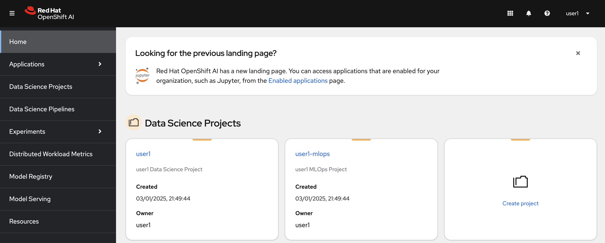
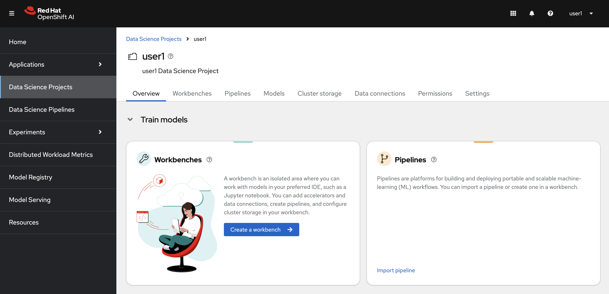
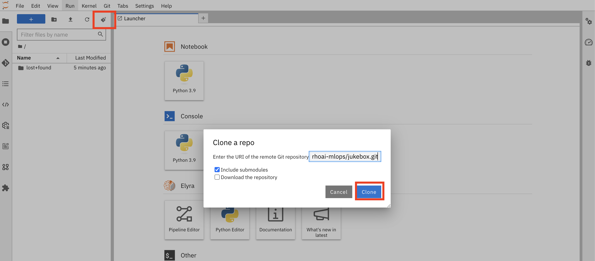

## Data Science Project

1. Login to OpenShift AI. The link and the credentials will be provided by your instructor.


2. Go to `Data Science Projects` and click `Create data science project` to create your own experimentation environment.



Put the name you choose as the project name and hit `Create`.



This project will be the place where we create our Jupyter Notebooke environment, train our model and deploy our model.


3. Let's create a notebook. Click `Create a Workbench`. OpenShift AI UI is pretty intiutive, isn't it? :)

   Select a name you want, could be something like `hitmusic-wb` 🍷

    For Notebook Image: 

    - Image selection: `Standard Data Science`

    - Version selection: `2024.1`

    - Deployment size: `Small`
    - Cluster storage: `20 GB`. 
    
    Let's keep the `Data connections` part empty for now. We'll get back to this later.

    And finally, hit `Create`.

4. When it is in the running stage, just click `Open`.

    

   It will redirect you to the Jupyter Notebook UI. You need to use your credentials again to log in. If you see the below screen, click `Allow selected permissions`. That will redirect you to your Jupyter Notebook.

    

5. Clone the Git repository that has model source code. Click the Git icon from the left menu, then select `Clone a Repository`. Copy the    GitHub link and clone the repository.

    ```bash
    https://github.com/rhoai-mlops/jukebox.git
    ```

    

    And now, your working environment is ready to get your hands dirty with some data!💥💪

    

    But before, there are two things we need to get done; setup our own Git repository and some S3 storage for experimentation 🫡