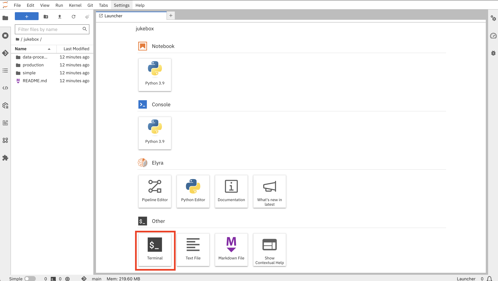

## Setup GitLab

Now we’ll setup our git projects to store our code and configuration. Spoiler alert: be watch out for GitOps 🦄🔥


1. Log into GitLab with your credentials. GitLab URL [here](https://<GIT_SERVER>):

    ```bash
    https://<GIT_SERVER>
    ```

2. Now lets create the git repository that we are going to use to store out Notebooks. Hit `New project` button on the right hand side
    

3. On the new view, use `jukebox` as Project Name, select **Internal** for Visibility level, then hit Create project. Make sure the project is in the group you created previously and not the username's.
    

4. Now let's go back to Jupyter Notebook. On the Launcher page, click `Terminal` at the bottom left and run below commands to push the `jukebox` code to the GitLab server.

    

5. Let's push our code to the GitLab server. Run the below commands:

    ```bash
    cd /opt/app-root/src/jukebox
    git remote set-url origin https://<GIT_SERVER>/<TEAM_NAME>/jukebox.git
    ```

    Use your username and password when you are prompted for the password (this will be cached).

    ```bash
    git push -u origin --all
    ```

    Now we are almost there with our initial setup!

    <p class="tip">
    ⛷️ <b>TIP</b> ⛷️ - If your credentials are cached incorrectly, you can try clearing the cache using: <strong>git credential-cache exit</strong>
    </p> 