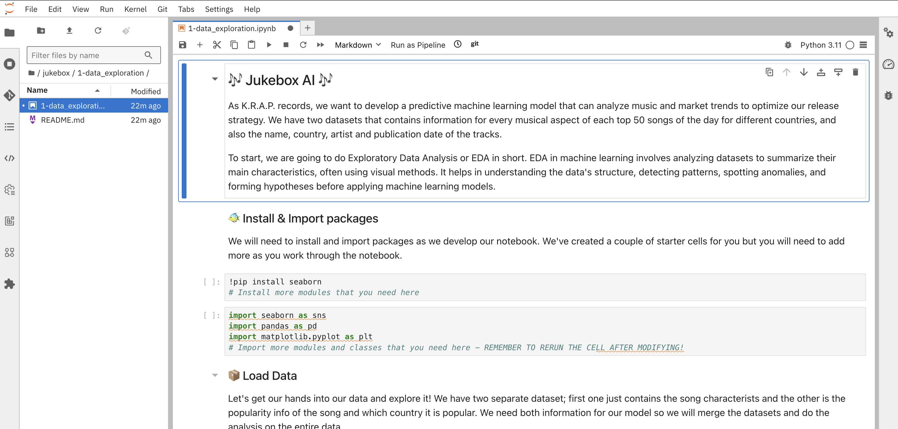

## Inner Data Science Loop

Just like in traditional software development world, here the inner loop represents the iterative process of building, testing, and refining machine learning models.

### Local development

This inner loop is essential in data science as it allows for continuous improvement and optimization of machine learning models.

- Data Preparation: Gathering, cleaning, and transforming data into a suitable format for model training.
- Model Development: Selecting and implementing appropriate machine learning algorithms.
- Model Training: Feeding the prepared data into the model and adjusting its parameters to learn patterns and relationships.
- Model Evaluation: Assessing the model's performance using metrics like accuracy, precision, recall, and F1-score.
- Model Refinement: Iterating on the previous steps to improve the model's accuracy and generalization capabilities.

For these steps, we will follow the steps in `jukebox/simple/1-experiment_train.ipynb` notebook. 

TODO: update screenshot

At the end, what we have is a working model we can serve from OpenShift AI. 

Now make your way to the Notebook and when you have a the model saved in a bucket, come back here to follow the next steps 😁

TODO: add screenshot from minio

### Model Serving

