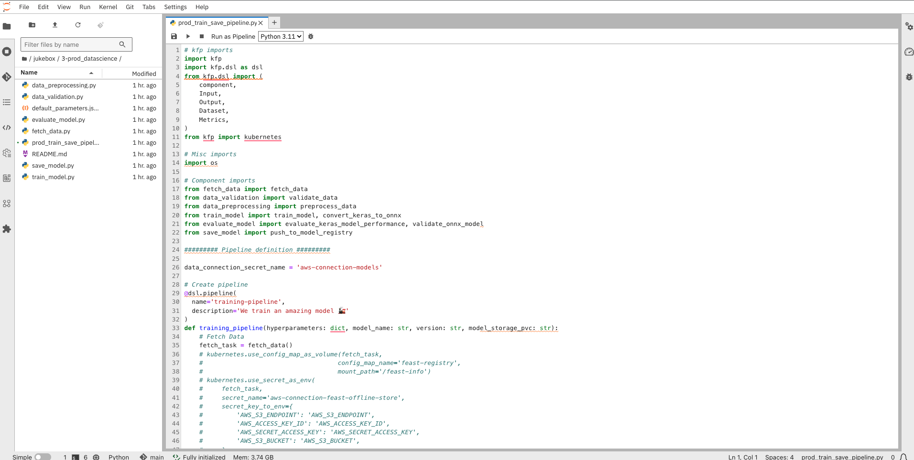

## Kubeflow Pipelines (KfP)

KfP is a powerful framework designed for building, deploying, and managing machine learning workflows on Kubernetes. It provides a robust set of tools for creating reusable and modular pipelines that can easily handle complex machine learning tasks, from data ingestion to model training and evaluation. KfP supports advanced features such as versioning, metadata tracking, and resource management, allowing teams to monitor and optimize their workflows effectively. By leveraging the scalability and orchestration capabilities of Kubernetes, KfP enables organizations to deploy production-ready machine learning solutions that can adapt to evolving data and model requirements seamlessly.

We will treat KfP as our production-grade training pipeline. It will be the pipeline that gets triggered when there is an update in the source code of the model, when there is fresh data we can use to train the model further, when there is an alert that the model is behaving unusual. Therefore, you will find the pipeline definition under `4-prod_datascience` folder. 

If you look at the files under this folder, they are mainly the steps that we have in the Notebooks we executed previously. The steps are broken down into individual functions and files to have better modularity, easy to update and maintain them. Also the functions have better error handling and reporting. 



Normally, we are not going to trigger this pipeline manually but just to test the functionality and view the output, let's go to Terminal and initiate a pipeline by running the below command:

```bash
cd /opt/app-root/src/jukebox/4-prod_datascience
python prod_train_save_pipeline.py
```

You need to see an output like this:

<div class="highlight" style="background: #f7f7f7">
<pre><code class="language-yaml">
    ...
    Experiment details: https://ds-pipeline-dspa.<TEAM_NAME>.svc:8443/#/experiments/details/5bca7df3-1f2d
    Run details: https://ds-pipeline-dspa.<TEAM_NAME>.svc:8443/#/runs/details/422f78a5-81a6-4052-9c8d-9d9d1a89b44a
</code></pre></div>


Go to OpenShift AI UI. Select Data Science Pipelines from the left menu and go to Runs. You'll see there is one run with the Running status. Click to see the details of the pipeline run.


You'll be able to get many details like the relationship between the steps, the output of each step, the artifacts that are generated, the metrics and graphs. 


 Feel free to spend some time in this view to explore more! 

Then let's continue to prepare the environment for MLOps practices 🙌