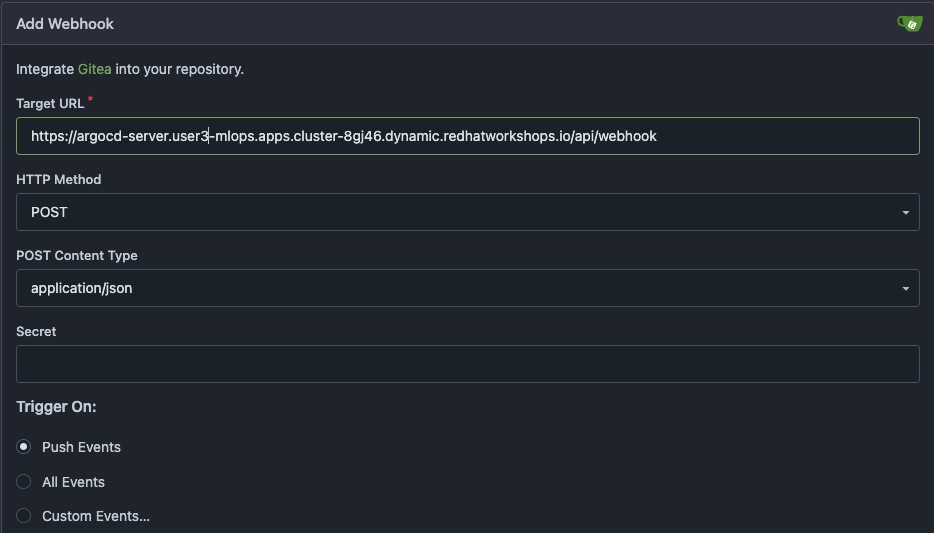

# Extend Toolings with GitOps

We need to add two more application to our MLOps toolings in order to run our continous training pipeline successfully; KubeFlow Registry & Data Science Pipelines Application (DSPA).

These two were already installed in your dev environment. Now we need to bring them in with GitOps. Go to your `code-server` terminal. 

1. In `mlops-gitops` repository, create `model-registry` folder under `toolings`. And then create a file called `config.yaml` under `model-registry` folder. Or simply run the below commands:

    ```bash
    mkdir /opt/app-root/src/mlops-gitops/toolings/model-registry
    touch /opt/app-root/src/mlops-gitops/toolings/model-registry/config.yaml
    ```

2. Open up the `model-registry/config.yaml` file and paste the below yaml to `config.yaml`. It contains the information about where Argo CD can find the helm chart about model registry, and the values we'd like to provide to this helm chart.

    ```yaml
  chart_path: charts/model-registry
  name: <USER_NAME>
  cluster_domain: <CLUSTER_DOMAIN>
    ```


3. Now, let's create the definition for Data Science Pipeline Application by creating `dspa` folder under `toolings`. And then create a file called `config.yaml` under `dspa` folder.

    ```bash
    mkdir /opt/app-root/src/mlops-gitops/toolings/dspa
    touch /opt/app-root/src/mlops-gitops/toolings/dspa/config.yaml
    ```

4. Open up the `dspa/config.yaml` file and paste the below yaml file. `config.yaml` for the same reasons. For Data Science Pipeline Application, we do not have to provide any specific value so it'll be a short config file.

    ```yaml
  chart_path: charts/dspa
    ```

5. Before we push our changes - we would like to sync our changes AS SOON AS updates hit the git repo! But Argo CD has a cycle time of about 3ish mins by default - this is too slow for us. However we can make Argo CD sync our changes instantly. For that, let’s add a webhook to connect Argo CD to our GitOps repository. Get ArgoCD URL with following:

    ```bash
    echo https://$(oc get route argocd-server --template='{{ .spec.host }}'/api/webhook  -n <USER_NAME>-mlops)
    ```
    > NOTE: This is the webhook url is used to connect ArgoCD to our GitOps repository, it's not meant to be opened in your browser :D  

6. Go to Gitea > `mlops-gitops` repository > Settings from top left. From the Settings page, click Webhooks and add a new Webhook as Gitea type.


7. Copy the Argo CD URL you get from the previous command as `Target URL` and hit `Add Webhook`.



8. And now, let's push the changes to our GitOps repository.

    ```bash
    cd /opt/app-root/src/mlops-gitops
    git add .
    git commit -m  "😻 ADD - Model Registry and DSPA 😻"
    git push
    ```

9. Check Argo CD to see the deployed applications :)


Next stop, setting up Argo CD for model deployments via GitOps!