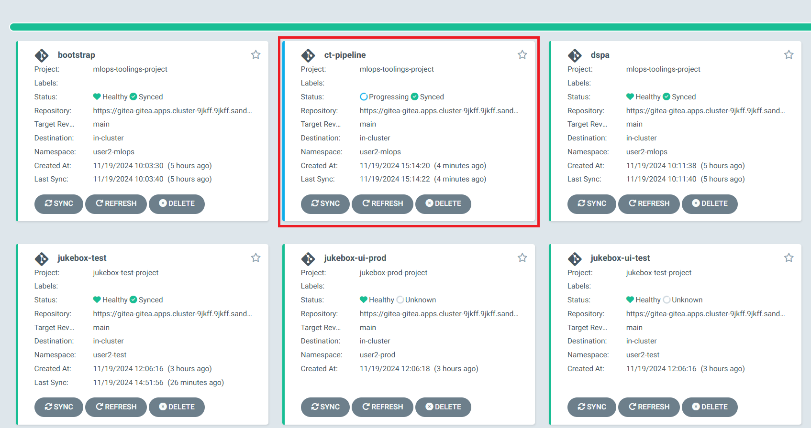
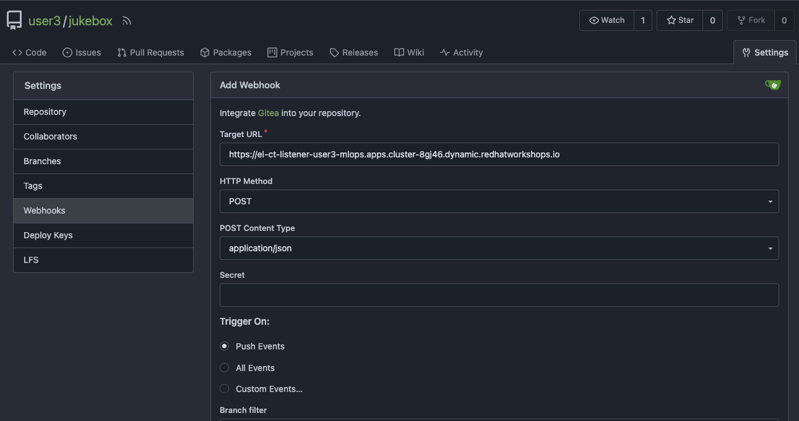
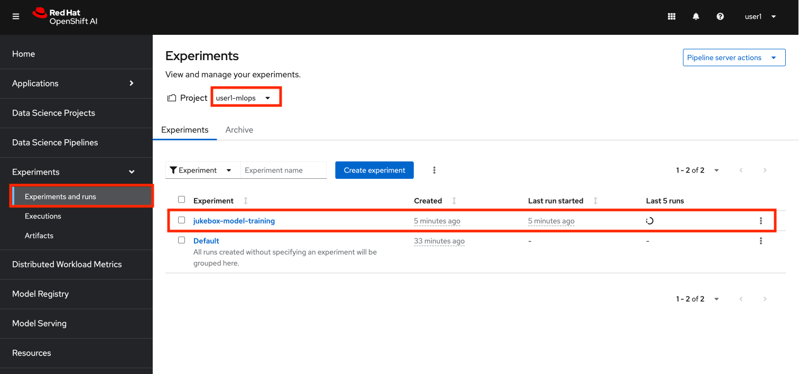

# Continuous Training Pipeline


## Deploy Continuous Training Pipeline

1. First, let's clone the Git repository that stores the pipeline definition. Go to GitLab > New Project and use `mlops-helmcharts` as the repository name. Select `Internal` as the visibility level.

```bash
    cd /opt/app-root/src
    git clone https://<GIT_SERVER>/<USER_NAME>/mlops-helmcharts.git
```

After cloning, from the left Explorer menu, go to `mlops-helmcharts/charts/pipelines`, see that we are calling KfP pipeline (that we ran manually in the previous chapter) from `templates/tasks/execute-ds-pipeline.yaml`. 

3. We need to apply this Tekton pipeline definition into our mlops namespace. This will give us a webhook we can use to trigger it, we need to put that webhook as a trigger in our `Jukebox` repository. Because we want to trigger the pipeline when there is a change in the model source code repository. (also for other stuff as well but no spoiler now 🤭)

Open up `mlops-gitops/toolings/values.yaml` and add the following piece of yaml.

```yaml
  # CT Pipeline
  - name: pipelines
    enabled: true
    source: https://<GIT_SERVER>/<USER_NAME>/mlops-helmcharts.git
    source_path: charts/pipelines
    source_ref: "main"
```

4. Again, this is GITOPS - so in order to affect change, we now need to commit things! Let's get the configuration into git, before telling Argo CD to sync the changes for us.

    ```bash
    cd /opt/app-root/src/mlops-gitops
    git add .
    git commit -m  "🥁 ADD - Continous training pipeline 🥁"
    git push
    ```

If you check from Argo CD, you'll see that the pipeline was popped up there already!



_Note: If you are seeing PVCs are still in Progressing status on Argo CD, it is because the OpenShift cluster is waiting for the first consumer, a.k.a. the first pipeline run, to create the Persistent Volumes. The sync status will be green after the first run._

5. Now, let's take the webhook and add it to the Jukebox repository. Run the below command and copy the webhook:

```bash
    echo https://$(oc -n <USER_NAME>-mlops get route el-ct-listener --template='{{ .spec.host }}')
```

6. Once you have the URL, over on Gitea go to `jukebox` repository > `Settings` > `Webhook` , choose `Gitea` to add the webhook:



You can test the webhook by clicking the URL, and then click `Test Delivery`:


7. This test delivery acts like a commit to Jukebox repository and it triggers the pipeline! You can observe the pipline running from OpenShift's `PipelineRuns` view as well as OpenShift AI's, yes, `Data Science Pipeline > Runs` view :D 

Go to OpenShift UI > Pipelines > PipelineRuns and click the colorful bar to see the logs.


Then go to the OpenShift AI UI > Pipeline Runs and click the current run to see the details.



The pipeline will build the model and save it in the S3, just like we manually did in the Data Science innerloop!

Next up, we need to prepare the environment for the model deployment ✨ via GitOps ✨