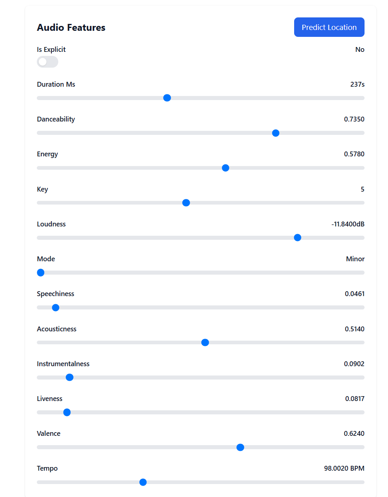

# Model Deployment via GitOps

We deployed our `jukebox` model in experiment environment manually, but for the higher environments we need to store the definitions in Git and deploy our models via Argo CD to get all the benefits that GitOps brings.

## 🚗 Modelcars and GitOpsifying the Deployment

When a new model version is generated by the training pipeline, whether triggered by a code change or a monitoring alert, our goal is to ensure it’s deployed automatically if it shows better performance (no worries, we'll make sure only the best models make it, just hang in there 😉). Alongside automation, we prioritize traceability, immutability, and reproducibility in the deployment process.

To meet these requirements, we use KServe's **ModelCars**, a feature that simplifies model deployment by containerizing models as Open Container Initiative (OCI) images. Essentially, these ModelCars serve as model storage for our model servers. With ModelCars, each model version is packaged into a container image, enabling versioning and ensuring that we can track and manage different iterations of models.

When the pipeline detects a Git push event, it tags the ModelCar with the Git commit ID. This ID links the model back to its source code changes, providing us with context about why and how the model was built.

Once the model artifact and its versioning information are created, the pipeline pushes the update to the `mlops-gitops/model-deployment/` repository. Argo CD then detects the change and updates the `InferenceService` configuration in OpenShift. This triggers an automated rollout of the new model version, seamlessly integrating it into production.

## Deploying Jukebox

1. Just like we did with our toolings, we need to generate `ApplicationSet` definition for our model deployment. We will have two separated AppSet definition; one is for `test` and one is for `prod` environment. For the enablement simplicity reasons, we keep them in the same repository. However in the real life, you may also like to take prod definitions into another repository where you only make changes via Pull Requests with a protected `main` branch. We keep AppSet definition separate so that it'll be easy to take the prod definition into another place later on :)

    Let's update the AppSet definition with `CLUSTER_DOMAIN` and `USER_NAME` definition just like before. Open up the `mlops-gitops/appset-test.yaml` and `mlops-gitops/appset-prod.yaml` files and replace the values. For the lazy ones we also have the commands:

  ```bash
    sed -i -e 's/CLUSTER_DOMAIN/<CLUSTER_DOMAIN>/g' /opt/app-root/src/mlops-gitops/appset-test.yaml
    sed -i -e 's/USER_NAME/<USER_NAME>/g' /opt/app-root/src/mlops-gitops/appset-test.yaml
    sed -i -e 's/CLUSTER_DOMAIN/<CLUSTER_DOMAIN>/g' /opt/app-root/src/mlops-gitops/appset-prod.yaml
    sed -i -e 's/USER_NAME/<USER_NAME>/g' /opt/app-root/src/mlops-gitops/appset-prod.yaml
  ```


2. Let's add `jukebox` model definition. We created two files since we have two different environments; `test` and `prod`. So we have two files to update. Update both `model-deployments/test/jukebox/config.yaml` and `model-deployments/prod/jukebox/config.yaml` files as follow. 

    This will take a model deployment helm-chart from our helm chart repository and apply the additional configuration such as image version.  

    ```yaml
    chart_path: charts/model-deployment/simple
    name: jukebox
    version: latest
    image_repository: quay.io
    image_namespace: rhoai-mlops
    ```
3. Let's get this deployed of course - it's not real unless its in git!

    ```bash
    cd /opt/app-root/src/mlops-gitops
    git add .
    git commit -m  "🐰 ADD - appsets and jukebox to deploy 🐰"
    git push 
    ```

4. With the `jukebox` values stored in Git, now let's tell Argo CD to start picking up changes to these environments. To do this, simply we need to create ApplicationSets:

    ```bash
    oc apply -f /opt/app-root/src/mlops-gitops/appset-test.yaml -n <USER_NAME>-mlops
    oc apply -f /opt/app-root/src/mlops-gitops/appset-prod.yaml -n <USER_NAME>-mlops
    ```

5. You should see the two Jukebox application, one for `test` and one for `prod` deployed in Argo CD. 

    

6. You can also go to OpenShift AI UI, select `Model Serving` in the left menu and then select one of the two projects to see the deployed models, just like we did in the inner loop.

    

## Using the Jukebox UI

As you can see from the Argo CD UI we have also created applications for a UI for the Jukebox model, both in test and prod. However, if you were to look inside them you will see that they are empty.  

Let's go ahead and get our UI deployed! 📺

1. Similar to with the jukebox model, we will update the currently empty `model-deployments/test/jukebox-ui/config.yaml` and `model-deployments/prod/jukebox-ui/config.yaml` with the following:  

    PROD:

    ```yaml
    repo_url: https://<GIT_SERVER>/<USER_NAME>/jukebox-ui
    chart_path: chart
    model_endpoint: https://jukebox-<USER_NAME>-prod.<CLUSTER_DOMAIN>
    model_name: jukebox
    image: quay.io/rhoai-mlops/jukebox-ui:1.0
    ```

    TEST:

    ```yaml
    repo_url: https://<GIT_SERVER>/<USER_NAME>/jukebox-ui
    chart_path: chart
    model_endpoint: https://jukebox-<USER_NAME>-test.<CLUSTER_DOMAIN>
    model_name: jukebox
    image: quay.io/rhoai-mlops/jukebox-ui:1.0
    ```

2. Then just push it to git and see it update in ArgoCD 🧙‍♂️

    ```bash
    cd /opt/app-root/src/mlops-gitops
    git add .
    git commit -m  "📺 UPDATE - jukebox-ui configs for deployment 📺"
    git push 
    ```

3. Verify that Jukebox UI is up and running:

    ```bash
    oc get po -l app.kubernetes.io/name=jukebox-ui -n <USER_NAME>-test
    ```
3. Now with our fresh new UI deployed, we can take a look at it by going to this route:

    ```bash
        https://jukebox-ui-<USER_NAME>-test.<CLUSTER_DOMAIN>
    ```

4. Play around with the sliders and try to predict a new location! 🗺️


