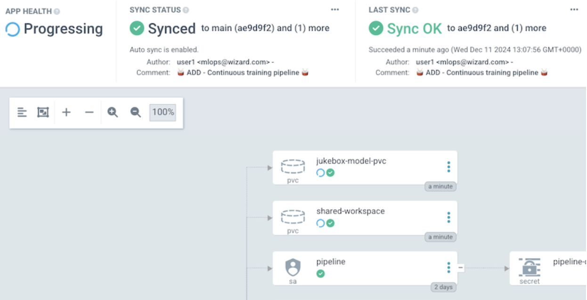
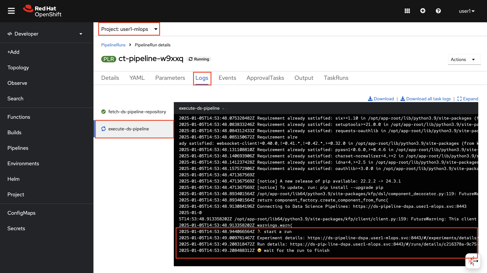

# Continuous Training Pipeline

In this exercise, we will set up OpenShift Pipelines (Tekton) to automatically trigger a Kubeflow Pipeline whenever there’s a push to the `jukebox` repository. The Kubeflow Pipeline will handle the model training, and once the model is ready, it will be deployed into a test environment for validation. To ensure traceability, the Tekton pipeline will update the model version information in the `mlops-gitops/model-deployments/test/jukebox` file in Git. This enables Argo CD to detect the change and manage the deployment update automatically.


## Deploy Continuous Training Pipeline

1. First, let's clone the Git repository that stores the Tekton pipeline definition. 

    ```bash
    cd /opt/app-root/src
    git clone https://<USER_NAME>:<PASSWORD>@<GIT_SERVER>/<USER_NAME>/mlops-helmcharts.git
    ```

    After cloning the repository, go to the `mlops-helmcharts/charts/pipelines` folder from the left Explorer menu. Inside, you’ll see that we are calling the Kubeflow Pipeline (the one we ran manually in the previous chapter) from the `templates/tasks/execute-ds-pipeline.yaml` file.

    Additionally, you will find several other steps that we will need to execute in the pipeline:

    

2. We need to apply this Tekton pipeline definition to our `<USER_NAME>-mlops` environment. This will provide us with a webhook URL, which we’ll add as a trigger in our `Jukebox` repository. This setup will ensure that our pipeline runs whenever there’s a change in the model source code (and maybe for other updates too, but let’s keep that a surprise for now 🤭).

    Create `ct-pipeline` folder under `mlops-gitops/toolings/` and `config.yaml` file under this newly created folder. Or simply run the below commands.
    `ct` here stands for Continuous Training :)

    ```bash
    mkdir /opt/app-root/src/mlops-gitops/toolings/ct-pipeline
    touch /opt/app-root/src/mlops-gitops/toolings/ct-pipeline/config.yaml
    ```

3. Open up the `ct-pipeline/config.yaml` file and paste the below yaml to `config.yaml`. It contains the information, you know the drill by now:

    ```yaml
    chart_path: charts/pipelines
    USER_NAME: <USER_NAME>
    cluster_domain: <CLUSTER_DOMAIN>
    ```

4. Again, this is GITOPS - so in order to affect change, we now need to commit things! Let's get the configuration into git, before telling Argo CD to sync the changes for us.

    ```bash
    cd /opt/app-root/src/mlops-gitops
    git add .
    git commit -m  "🥁 ADD - Continuous training pipeline 🥁"
    git push
    ```

    If you check from Argo CD, you'll see that the pipeline was popped up there already!

    

    _Note: If you are seeing PVCs are still in Progressing status on Argo CD, it is because the OpenShift cluster is waiting for the first consumer, a.k.a. the first pipeline run, to create the Persistent Volumes. The sync status will be green after the first run._

    

5. Now, let's take the webhook and add it to the Jukebox repository. Run the below command and copy the webhook URL:

    ```bash
    echo https://$(oc -n <USER_NAME>-mlops get route el-ct-listener --template='{{ .spec.host }}')
    ```

6. Once you have the URL, in Gitea go to `jukebox` repository > `Settings` > `Webhooks` , choose `Gitea` to add the webhook:

    

    You can test the webhook by clicking the URL, and then click `Test Delivery`:

    
    

7. This test delivery acts as a commit to the Jukebox repository, which in turn triggers the pipeline! We will monitor the pipeline’s progress both from OpenShift Console `PipelineRuns` view and on OpenShift AI’s `Data Science Pipeline` > `Runs` view. (too many pipelines!🙈)

    First, go to `OpenShift Console` > `Pipelines` > `PipelineRuns` and click the `colorful bar` to see the logs.

    Make sure you are in `<USER_NAME>-mlops` project.

    

    or you can use this link:

    ```bash
    https://console-openshift-console.<CLUSTER_DOMAIN>/pipelines/ns/<USER_NAME>-mlops/pipeline-runs
    ```

    In the Tekton Pipeline run logs, you’ll notice that the Kubeflow Pipelines are triggered in the second step.

    

    As soon as the Kubeflow pipeline has been triggered, you can go to the `OpenShift AI Dashboard` >  `Experiments` > `Experiments and Runs` and click the current run to see the details.

    

    The pipeline will build the model, containerize it, deploy it, and save the information to the Kubeflow Registry, just like we did manually in the Data Science inner loop!!

    The first run of this pipeline will take some time to complete. However, for subsequent runs, we’ll leverage Kubeflow Pipeline’s caching feature, which reuses results from previous steps when inputs haven’t changed. This significantly reduces processing time and speeds up the pipeline 🧚‍♂️🧚‍♂️