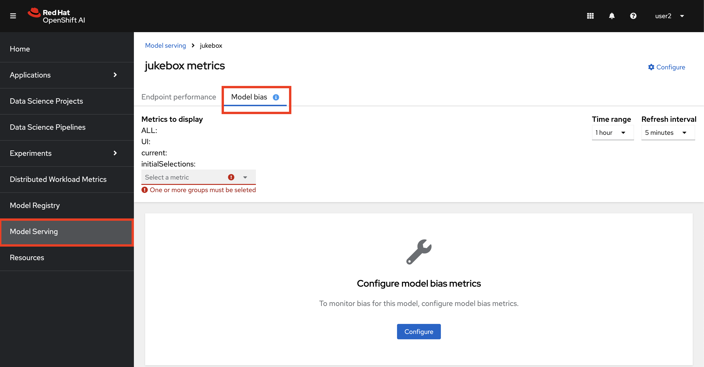

## TrustyAI

In traditional software, we mostly care about system's operational expectations like latency and throughput, which we have looked at in the previous section. For a machine learning system, we care about both operational metrics and models' performance metrics. For that, we'll use a tool called TrustyAI.


### Install TrustyAI

ML systems often fail silently. 


1. TrustyAI requires to run next to the models we want to observe. Create a `trustyai` folder under `model-deployments/test` and `model-deployments/prod` as we want to monitor both. 

    ```bash
    mkdir /opt/app-root/src/mlops-gitops/model-deployments/test/trustyai
    touch /opt/app-root/src/mlops-gitops/model-deployments/test/trustyai/config.yaml
    mkdir /opt/app-root/src/mlops-gitops/model-deployments/prod/trustyai
    touch /opt/app-root/src/mlops-gitops/model-deployments/prod/trustyai/config.yaml
    ```

2. Open up both `trustyai/config.yaml` file and paste the below line to let Argo CD know which chart we want to deploy.

    ```yaml
    chart_path: charts/trustyai
    ```

3. Commit the changes to the repo as you’ve done before.

    ```bash
    cd /opt/app-root/src/mlops-gitops
    git add .
    git commit -m "🔦🏡 TrustyAI added 🔦🏡"
    git push
    ```

4. Check if the TrustyAI is deployed in your test and prod environment. Go to `Model Serving` , click on `jukebox` and observe there is a new tab called `Model bias` now.

    

    Alternatively, you can check the pods as well:

     ```bash
    oc get pod  -l app=trustyai-service -n <USER_NAME>-test
    ```

    


### Configure TrustyAI for Data Drift

1. Let's go back to Jupyter Notebook workbench in `<USER_NAME>` namespace and configure TrustyAI service to check if there is a drift between the data we used to train our model and the data we get in the requests. Likewise, we will also ask TrustyAI to check the output predictions if there is a drift there too. In the workbench, open up `jukebox/4-metrics/1-trustyai_setup.ipynb` and follow up the instructions. When the setup is done, we will introduce a drift by using `jukebox/4-metrics/2-introducing_drift.ipynb` notebook. 

After we introduce a drift, come back here so we can observe the metrics by querying Prometheus and create a new dashboard in Grafana!📈📉

2. 