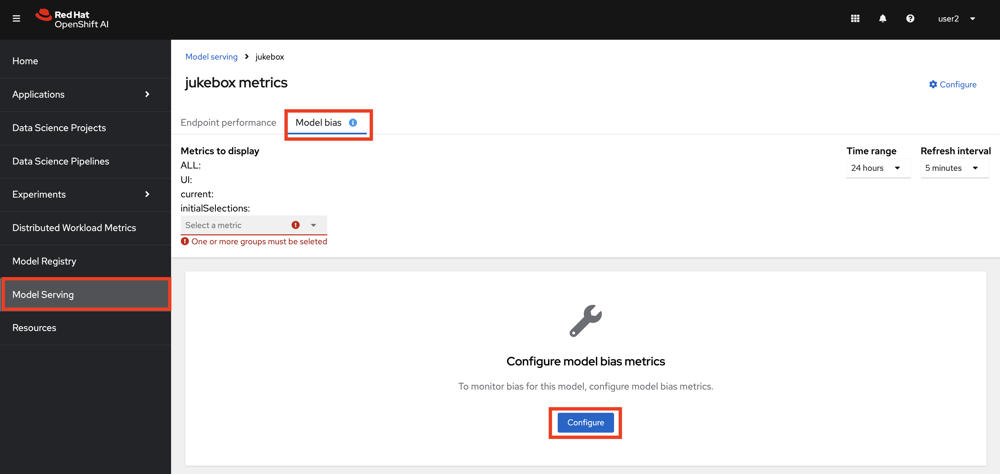
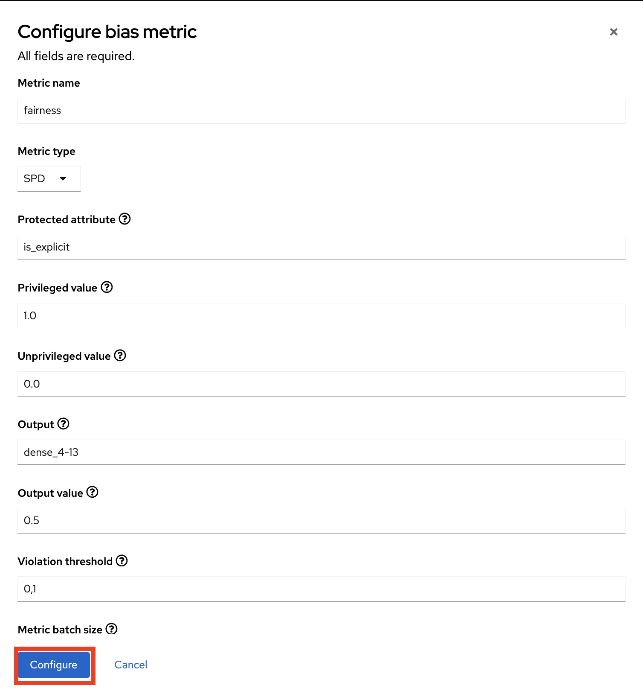
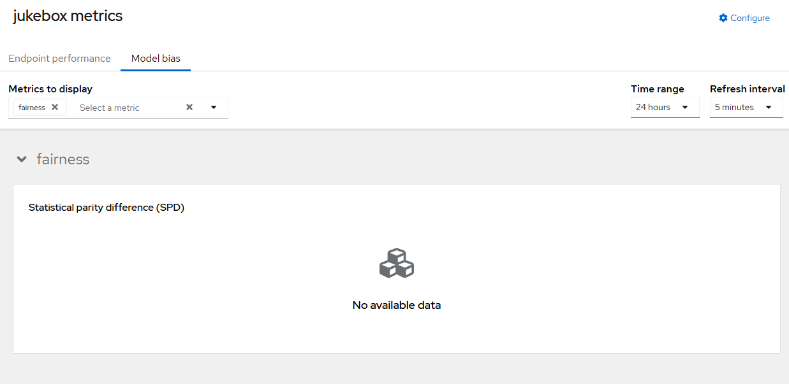
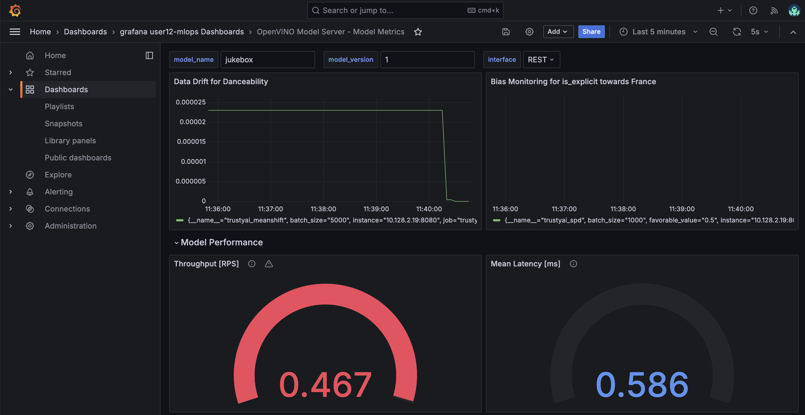

# TrustyAI

In traditional software, we mostly care about system's operational expectations like latency and throughput, which we have looked at in the previous section. For a machine learning system, we care about both operational metrics and models' performance metrics. For that, we have TrustyAI.

TrustyAI is an open source community dedicated to providing a diverse toolkit for responsible AI development and deployment that maintains projects revolving around model explainability, model monitoring, and responsible model serving. We'll use TrustyAI to detect drifts in data and model to make sure model works as expected.

## Install TrustyAI

1. TrustyAI requires to run next to the models we want to observe. Create a `trustyai` folder under `model-deployments/test` and `model-deployments/prod` as we want to monitor both. 

    ```bash
    mkdir /opt/app-root/src/mlops-gitops/model-deployments/test/trustyai
    touch /opt/app-root/src/mlops-gitops/model-deployments/test/trustyai/config.yaml
    mkdir /opt/app-root/src/mlops-gitops/model-deployments/prod/trustyai
    touch /opt/app-root/src/mlops-gitops/model-deployments/prod/trustyai/config.yaml
    ```

2. Open up both `test/trustyai/config.yaml` and `prod/trustyai/config.yaml` files and paste the below line to let Argo CD know which chart we want to deploy.

    ```yaml
    chart_path: charts/trustyai
    ```

3. Commit the changes to the repo as you’ve done before.

    ```bash
    cd /opt/app-root/src/mlops-gitops
    git add .
    git commit -m "🔦🏡 TrustyAI added 🔦🏡"
    git push
    ```

4. Check if the TrustyAI is deployed in your test and prod environment. Go to `Model Serving` , click on `jukebox` and observe there is a new tab called `Model bias` now.

    

    Alternatively, you can check the pods as well:

     ```bash
    oc get pod  -l app=trustyai-service -n <USER_NAME>-test
    ```

    


## Configure TrustyAI for Data Drift

Most machine learning models are highly sensitive to the distribution of the data they receive; that is, how the individual values of various features in inbound data compare to the range of values seen during training. Often, models will perform poorly on data that looks distributionally different than the data it was trained on. 

Imagine you're a songwriter trying to create hits based on your knowledge of what’s popular in each country. You studied past hit songs in each country (your training data) and wrote songs you believe would appeal to those audiences. Now, suppose you release a song, but during this time, one country suddenly shifts its preferences to a different genre, like moving from pop to electronic dance music. This unexpected shift (data drift) makes your song less likely to succeed there, not because it's poorly made, but because your information about that country’s preferences is outdated.

Data drift in this context is like trying to write a hit song based on old trends while the music scene evolves faster than you anticipated. 

1. Let's go back to Jupyter Notebook workbench in `<USER_NAME>` namespace and configure TrustyAI service to check if there is a drift between the data we used to train our model and the data we get in the requests. Likewise, we will also ask TrustyAI to check the output predictions if there is a drift there too. In the Jupyter Notebook workbench, open up `jukebox/4-metrics/1-trustyai_setup.ipynb` and follow up the instructions. When the setup is done, we will introduce a drift by using `jukebox/4-metrics/2-introducing_drift.ipynb` notebook. 

    After we introduce a drift, come back here so we can observe the metrics by querying Prometheus and create a new dashboard in Grafana!📈📉

2. Go to OpenShift UI in Developer view > Observe > Metrics and run the below query to visualize the metrics:

    ```bash
    trustyai_meanshift{subcategory=~"input-2|input-3"}
    ```

    If you remember from the `1-trustyai_setup.ipynb` Notebook, `input-2` is mapped to `danceability`, and `input-3` is mapped to `energy`. 

## Configure TrustyAI for Model Bias

Ensuring that your models are fair and unbiased is a crucial part of establishing trust in your models amonst your users. While fairness can be explored during model training, it is only during deployment that your models have exposure to the outside world. It does not matter if your models are unbiased on the training data, if they are dangerously biased over real-world data, and therefore it is absolutely crucial to monitor your models for fairness during real-world deployments.

In our case, we will take a feature of our data (`is_explicit`) and see if the model is biased towards a given country (let's say `France`) when the songs are explicit. 

1. We can set this up either through OpenShift AI UI or through the notebook. Let's set it from UI this time. Go to OpenShift AI > Model Serving > `jukebox` and click `Model bias`, then hit `Configure`.

    

2. Fill out the form as below:

    - Metric name: `fairness`
    - Metric type: `SPD`
    - Protectied attribute: `is_explicit`
    - Priviliged value: `1.0`
    - Unpriviliged value: `0.0`
    - Output: `output-13`
    - Output value: `0.5`
    - Violation threshold: `0,1`
    - Metric batch size: `1000`

    

3. It should generate a graph like this one:

    

4. Alternatively, if you create a new cell and add this into your notebook `jukebox/4-metrics/1-trustyai_setup.ipynb` , run the cell, you'll get the same result.

    ```python
    # Get bias for a specific field-couple
    endpoint = "/metrics/group/fairness/spd"
    url = urljoin(base_url, endpoint)

    payload = {
        "modelId": model_name,
        "protectedAttribute": "is_explicit",
        "privilegedAttribute": 1.0,
        "unprivilegedAttribute": 0.0,
        "outcomeName": "outcome-13",
        "favorableOutcome": 0.5,
        "batchSize": 1000
    }

    response = requests.post(url, headers=headers, json=payload)
    print(response.text)
    ```

## Update Grafana with new dashboards 

We might want to see operational and model performance related metrics in the same dashboard. For that, we can extend our previous Grafana dashboard and have a good overview of how the model is doing.

1. We define everything as code, including our dashboards. You can see the JSON definition of the dashboards in Gitea [here](https://gitea-gitea.<CLUSTER_DOMAIN>/<USER_NAME>/mlops-helmcharts/src/branch/main/charts/grafana/templates/grafana-dashboard.yaml). Open up `mlops-gitops/toolings/grafana/config.yaml` file and update as below:

    ```yaml
    chart_path: charts/grafana
    include_trusty: true  # 👈 add this
    ```

2. Commit the changes.

    ```bash
    cd /opt/app-root/src/mlops-gitops
    git add .
    git commit -m "🔦 TrustyAI metrics visualization added 🏡"
    git push
    ```

3. Go back to Grafana and view the updated dashboards for Jukebox;

    ```bash
    # get the route and open it in your browser
    echo https://$(oc get route jukebox-grafana-route --template='{{ .spec.host }}' -n <USER_NAME>-mlops)
    ```

    Use `Log in with OpenShift` to login and display the dashboards. Go to `Dashboards` > `grafana <USER_NAME>-mlops Dashboards` > `OpenVINO Model Server - Model Metrics`

    

