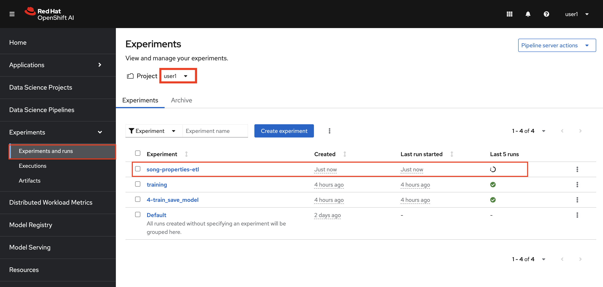

# Data Versioning

Data is often updated or modified, and we need to know which version was used to train or evaluate a model to ensure reproducibility. 

Without versioning, it’s hard to debug issues or compare results consistently. It’s like saving drafts of a document so you can go back and see what’s changed or restore an earlier version if needed.

For this, we will use an open source tool called DVC (Data Version Control).

Let's start by looking at Data Versioning using DVC in the inner loop. We will later move on to the outer loop by modifying our pipelines to automatically account for data version.

## (tiny) ETL

Before we start versioning the data, we need to have it somewhere we control. Besides GitHub not being the best place for storing data, because of the max storage limit they have, we may also want to store it inside our cluster.

For this, we will have a S3 bucket that can hold our data, and we will version the data inside that bucket.

Let's start by moving some data into the bucket.

1. Go to `OpenShift AI Dashboard` >  `Data Science Projects` > `<USER_NAME>` > `Workbenches` and connect to your first Jupyter notebook workbench.

    Open up `jukebox/5-data-versioning/1-data_pipeline_url_to_s3.py` file. This pipeline will move the data we currently have in GitHub over to our S3 bucket `data`. Later on we will also let the pipeline automatically version our data, but for now we just need to get some data.

    Click ▶️ on Run button to start the pipeline.

    

    This will trigger the pipeline that you can view on `OpenShift AI Dashboard` > `Experiments and runs` in your `<USER_NAME>` project.

    

    Lets wait for it complete successfully.

    

## Data Versioning

With the data now stored in an S3 bucket, let’s explore how to use DVC to track and version your datasets. Follow the steps below using the provided Jupyter notebooks:

1. Open the notebook located at `jukebox/5-data-versioning/2-dvc-s3-track-remote-data.ipynb`. Follow the instructions to initialize the DVC configuration and connect it to your S3 bucket.

2. After completing the steps in the notebook, you'll notice a DVC file named `song_properties.parquet.dvc` has been created. This file tracks your dataset's metadata and links it to the remote storage.

3. Next, let's simulate a data change and create a new version. Open and execute the notebook at `jukebox/5-data-versioning/3-dvc-s3-see-change.ipynb` to introduce changes to the dataset and update the version.

Now let's see what this look like in the outer loop ⛷️
