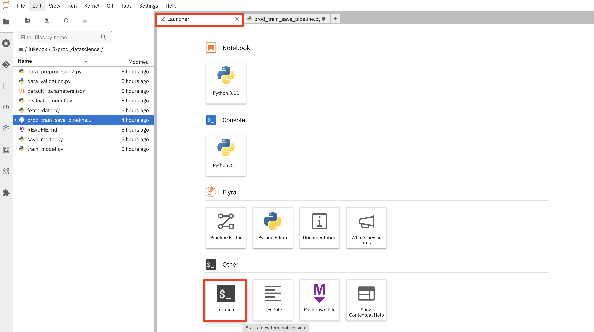
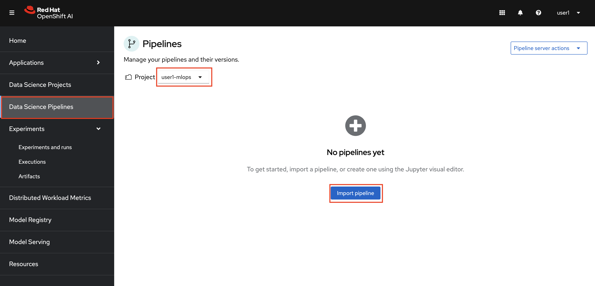
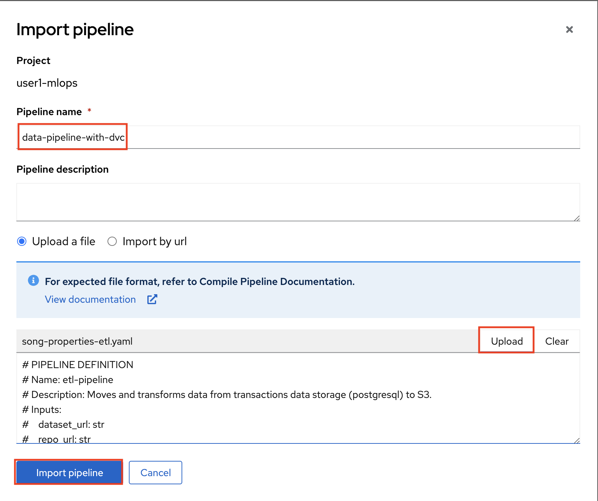
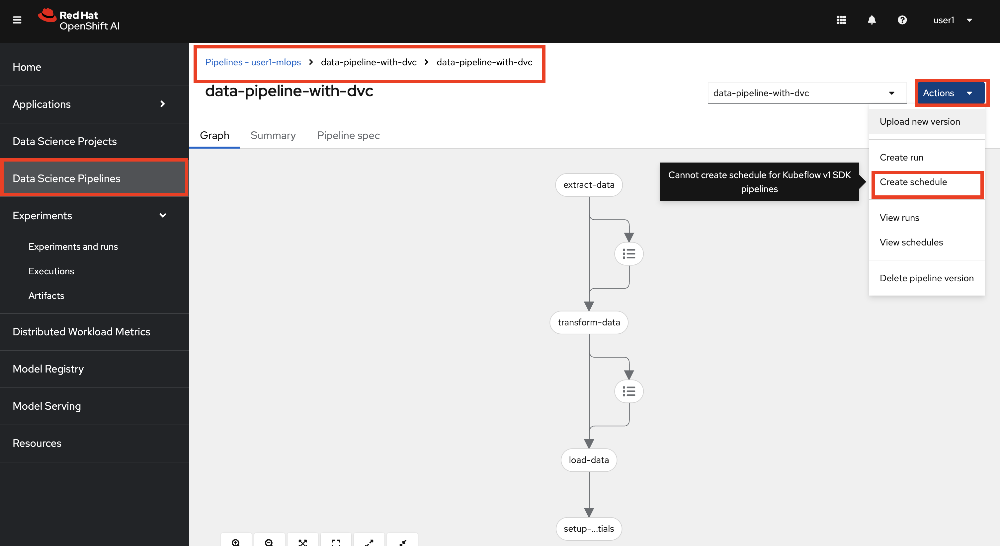
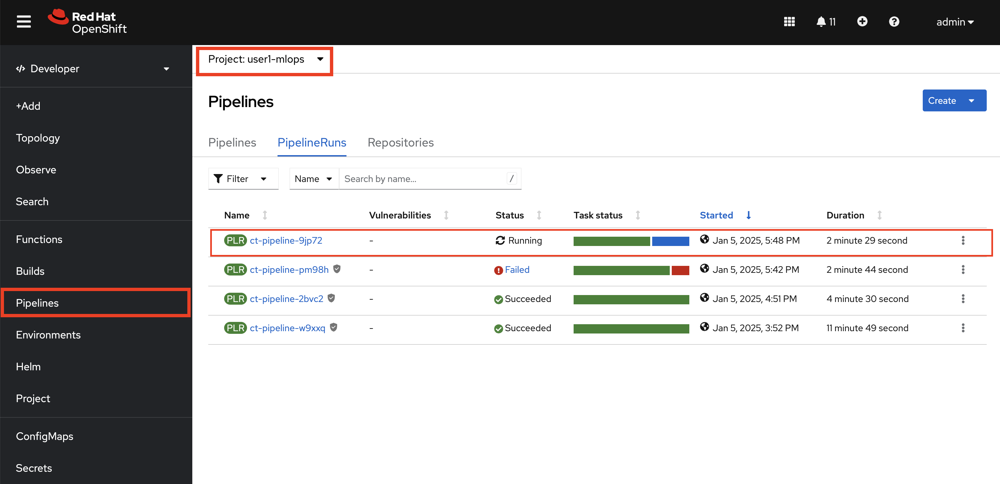
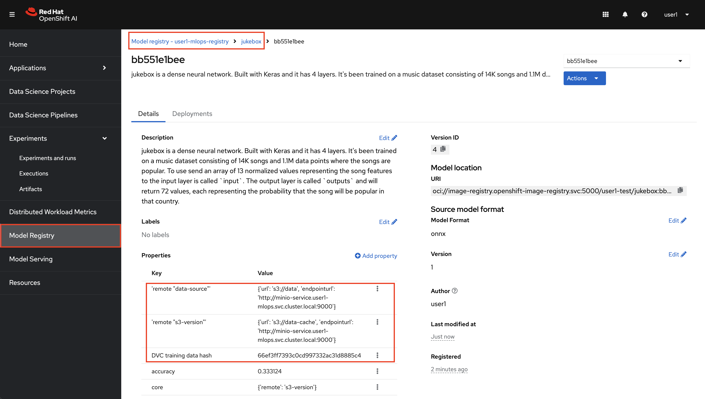

## Update Continuous Training Pipeline with Data Versioning


### Setup MinIO

1. First, we need to have `data` and `data-cache` buckets in our MLOps environment too. Previously, we were in inner loop, buckets were already there. But in MLOps environment we aim to practice GitOps as much as we can, so we store bucket info as code in Git too. Go back to your `code-server` and update `mlops-gitops/toolings/minio/config.yaml` as below:

    ```bash
        chart_path: charts/minio
        buckets:
        - name: pipeline
        - name: models
        - name: data # 👈 add this
        - name: data-cache # 👈 add this
    ```


2. Commit the changes to the repo as you’ve done before.

    ```bash
    cd /opt/app-root/src/mlops-gitops
    git pull
    git add .
    git commit -m "🪣 data buckets added 🪣"
    git push
    ```


### Update CT Pipeline

1. Let's go back to Jupyter Notebook. Now that we got familiar with DVC, we can update our pipeline to stop fetching all the data from GitHub and fetch the song properties data based on the dvc file in `Jukebox` git repository.  For that, we need to comment out the initial `fetch_data()` function and introduce a new one that calls dvc commands.
   
    In your Jupyter Notebook, open `jukebox/3-prod_datascience/prod_train_save_pipeline.py`, and comment out below line by putting **＃** in front of it, or when you are on that line, hit CTRL (Command) + Shift. 

    ```python
    ...
    def training_pipeline(hyperparameters: dict, model_name: str, version: str, cluster_domain: str, model_storage_pvc: str, prod_flag: bool):
        ### 🐶 Fetches Data from GitHub
        fetch_task = fetch_data() # 👈 Comment out this one
    ...
    ```

2. After you comment it out, add the below function right under it. You'll see the `🍇 Fetches data from DVC` comment there. Make sure you save the file!

    ```python
        ### 🍇 Fetches data from DVC
        fetch_task = fetch_data_from_dvc(
            cluster_domain = cluster_domain,
            git_version = version
        )
        kubernetes.use_field_path_as_env(
            fetch_task,
            env_name='namespace',
            field_path='metadata.namespace'
        )

        kubernetes.use_secret_as_env(
            fetch_task,
            secret_name='aws-connection-data',
            secret_key_to_env={
                'AWS_S3_ENDPOINT': 'AWS_S3_ENDPOINT',
                'AWS_ACCESS_KEY_ID': 'AWS_ACCESS_KEY_ID',
                'AWS_SECRET_ACCESS_KEY': 'AWS_SECRET_ACCESS_KEY',
                'AWS_S3_BUCKET': 'AWS_S3_BUCKET',
            },
        )
        kubernetes.use_secret_as_env(
            fetch_task,
            secret_name='git-auth',
            secret_key_to_env={
                'username': 'username',
                'password': 'password',
            },
        )
    ```


3. Let's persist the changes in Git. On Jupyter Notebook, in `Launcher`, select `Terminal`:

   

   ..and run the below commands.

    ```bash
    cd /opt/app-root/src/jukebox/
    git add 3-prod_datascience/prod_train_save_pipeline.py
    git commit -m "🍇 fetch data via DVC 🍇"
    git push
    ```

4. This push triggers our training pipeline, however, the pipeline will fail. Any guesses why? Yes! Previously, we actually haven't pushed any dvc config file to `Jukebox` repository, so during the fetch data step, pipeline will fail. But we don't want to commit the dvc files manually everytime there is a change in our data. We want to automate this as well. Therefore, we need to introduce yet another pipeline.


### Data Pipeline with DVC Versioning

1. In your Jupyter Notebook, open up `5-data-versioning/4-data_pipeline_with_dvc_versioning.py` file and run this by clicking ▶️ button.

    This time, instad of triggering a pipeline, it created a YAML file. If you open up folder `5-data-versioning/` , refresh it by hitting Refresh button, you should see `song-properties-etl.yaml`

    Let's download this file and store locally. 

    

2. In OpenShift AI Dashboard, go to `Data Science Pipelines` > `<USER_NAME>-mlops`, click `Import pipeline`. 

    

3. Use `data-pipeline-with-dvc` as Pipeline name and upload the YAML file you just downloaded to your local by clicking `Upload` button. Then `Import pipeline`. 

    

   This pipeline automates the tasks you completed in the previous section during the inner loop: fetching data, configuring DVC, storing data in S3, and versioning the song properties data, PLUS one more step. It will take the DVC version file and commit it to the `Jukebox` repository.

    

    And what this commit will do? Yes, it will trigger the Continuous Training pipeline 🎉

4. Ideally, you’d want to set up this data pipeline to run periodically. This way, whenever fresh data becomes available, the pipeline can process it, transform it, version it, and retrain the model using the updated data. Let’s see how to set this up.

    While you are in `data-pipeline-with-dvc` view, click `Action` from upper right corner, and select `Create schedule`.

    

    For **Schedule details:**

    - name: `data-pipeline-with-dvc-daily`
    - Trigger type: `Periodic`
    - Run every `1 Day`
  
    Leave the rest as default until `Parameters` section.

    For **Parameters:**

    - dataset_url: `https://github.com/rhoai-mlops/jukebox/raw/refs/heads/main/99-data_prep/song_properties.parquet`

    - repo_url: `https://gitea-gitea.<CLUSTER_DOMAIN>/<USER_NAME>/jukebox.git`

    ..and hit `Creates schedule`.

5. You can see this scheduled runs under `Experiments` > `Experiment and runs` > `Default` > Schedules`

    

6. But let's not wait for it to run. Just like we scheduled, we can also create an ad-hoc run. Got back to `Data Science Pipelines` > `data-pipeline-with-dvc` and click `Actions` on the upper right corner again, and select `Create run`.

    

    Again, the similar information:

    - Name: `data-pipeline-with-dvc-adhoc-run`
    - dataset_url: `https://github.com/rhoai-mlops/jukebox/raw/refs/heads/main/99-data_prep/song_properties.parquet`

    - repo_url: `https://gitea-gitea.<CLUSTER_DOMAIN>/<USER_NAME>/jukebox.git`

    ..and hit `Create run`. The pipeline will start running immediately.

    


7. When the pipeline finished, check `Jukebox` git repository. You should be able to see a `.dvc/config` folder and a `song_properties.parquet.dvc` file. 

    

    DVC files were pushed by the data pipeline, which means Continuous Training Pipeline must have been triggered. Let's check the OpenShift pipeline.

    Go to OpenShift UI > Pipelines > `ct-pipeline`

    

    Now apart from code change and alerts, the pipeline gets triggered when there is fresh data!

8.  Check Model Registry, you now have dvc config there as well as which version of the data was used to build this version of the Machine Learning model.

    

