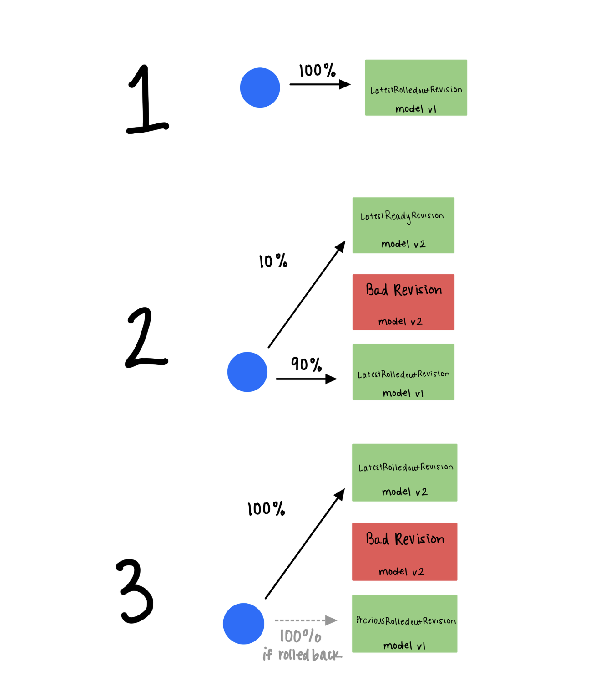

# Advanced Deployments

Machine learning models don’t operate in isolation; they are often integrated into larger systems. With each release, it’s critical to ensure that existing integrations remain intact, the system’s performance is maintained or improved, and security and compliance requirements are met. Advanced deployment practices, such as canary releases, help minimize the risk of introducing regressions, reduce downtime, and enable confident rollouts of new versions.

## Canary Deployments

Canary deployments, or A/B deployments, generally imply running two versions of the application at the same time for testing or experimentation purposes. Initially, you have one model handling all the requests. Then, a new version is deployed, and some of the traffic is routed to it. If the new version performs as expected, we gradually shift all traffic to it and retire the original model. However, if any issues arise with the new model, we can quickly revert all traffic back to the original model without the need for redeployment or additional waiting. Essentially, this <sup>[1](https://kserve.github.io/website/latest/modelserving/v1beta1/rollout/canary/)</sup>👇 



KServe can distribute the traffic that coming to model endpoint. But how does it do it? KServe holds the information of each version of the models we deploy. By default, it sends 100% traffic to the latest deployed version. See this by running the following command in code-server terminal.

  ```bash
  oc get isvc jukebox -n <USER_NAME>-test
  ```

  You should get an output similar to this:

  <div class="highlight" style="background: #f7f7f7; overflow-x: auto; padding: 10px;">
  <pre><code class="language-bash">
    NAME      URL                                                                          READY   PREV   LATEST   PREVROLLEDOUTREVISION   LATESTREADYREVISION       AGE
    jukebox   https://jukebox-<USER_NAME>-test.<CLUSTER_DOMAIN>   True           100                              jukebox-predictor-00003   2d2h
    </code></pre>
    </div>

  What this output tells you that the 100% of the traffic is going to the LATEST version.


1. Let's enable canary deployment in `InferenceService` for test environment by updating `mlops-gitops/model-deployments/test/jukebox/config.yaml` on code-server workbench.

    ```bash
    ---
    chart_path: charts/model-deployment/music-transformer
    name: jukebox
    version: 4562a17c17
    image_repository: image-registry.openshift-image-registry.svc:5000
    image_namespace: <USER_NAME>-test
    autoscaling: true
    canary:  # 👈 add this
      trafficPercent: 20 # 👈 add this
    ```

    This will update the `InferenceService` by adding the below config, and spin up the previous version of the model as well, to divide the traffix 80% to 20% among them. 

    <div class="highlight" style="background: #f7f7f7">
    <pre><code class="language-yaml">
      ---
      apiVersion: serving.kserve.io/v1beta1
      kind: InferenceService
      metadata:
        name: jukebox
        annotations:
          openshift.io/display-name: jukebox
          serving.knative.openshift.io/enablePassthrough: 'true'
          sidecar.istio.io/inject: 'true'
          sidecar.istio.io/rewriteAppHTTPProbers: 'true'
          autoscaling.knative.dev/target: "1"
        finalizers:
          - inferenceservice.finalizers
        labels:
          opendatahub.io/dashboard: 'true'
      spec:
        predictor:
          canaryTrafficPercent: 20 ### 👈 this does the magic 🔮
       ...
    </code></pre></div>


2. Let's push the change. This will redeploy the previous version automatically do split the traffic based on the percentage we provided above. 

    ```bash
    cd /opt/app-root/src/mlops-gitops
    git pull
    git add .
    git commit -m  "🦜 UPDATE - canary deployment enabled 🦜"
    git push
    ```

3. After Argo CD syncs the changes, check the output of previous command again.
   
    ```bash
    oc get isvc -n <USER_NAME>-test
    ```

    You should get an output like this:

    <div class="highlight" style="background: #f7f7f7; overflow-x: auto; padding: 10px;">
    <pre><code class="language-bash">
        NAME      URL                                                                           READY   PREV   LATEST   PREVROLLEDOUTREVISION     LATESTREADYREVISION       AGE
        jukebox   https://jukebox-<USER_NAME>-test.<CLUSTER_DOMAIN>   True    80     20       jukebox-predictor-00002   jukebox-predictor-00003   25h
   </code></pre></div>


4. Let's check if we are really able to send 20% of the traffic to the latest version while the rest of the traffic is being handled by the previous version. We can rely on `locust` to generate some traffic again. Let's go back to Jupyter Notebook and open `jukebox/6-advanced_deployments/2-canary_testing.ipynb`

5. After you start generating the traffic, let's go to [Grafana](https://jukebox-grafana-route-<USER_NAME>-mlops.<CLUSTER_DOMAIN>/) you previously deployed.

  ```bash
  https://jukebox-grafana-route-<USER_NAME>-mlops.<CLUSTER_DOMAIN>/
  ```