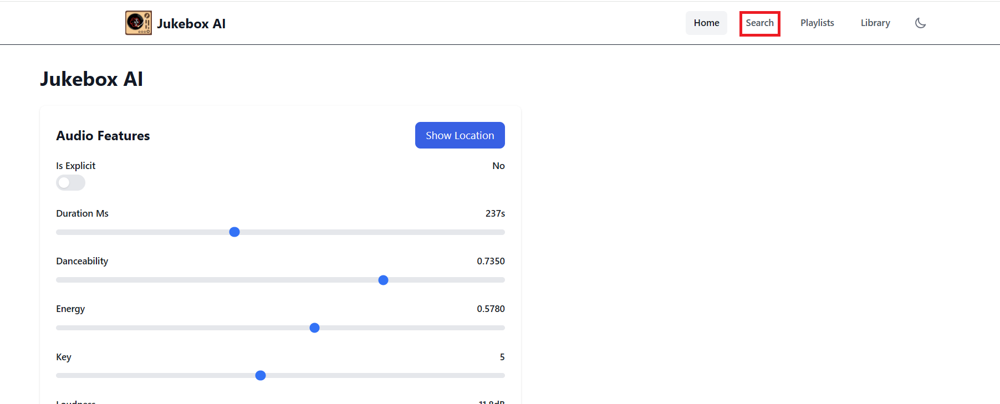

# Using Feast for inference

Besides using Feast for getting features to train on, we can also use Feast for getting features during inference.  
This is a great way to make sure that the same features are used in both training and serving.  
Before we deploy our new model server that uses Feast, let's deploy a Feast Server and UI, to make our feature consumption simpler and allow us to browse the features.  

## Feast Server and UI

```bash
mkdir /opt/app-root/src/mlops-gitops/toolings/feast-server
touch /opt/app-root/src/mlops-gitops/toolings/feast-server/config.yaml
```

```yaml
repo_url: https://github.com/feast-dev/feast.git
target_revision: v0.40.1
chart_path: infra/charts/feast-feature-server
feature_store_yaml_base64: cHJvamVjdDogbXVzaWMKcHJvdmlkZXI6IGxvY2FsCnJlZ2lzdHJ5OgogICAgcmVnaXN0cnlfdHlwZTogc3FsCiAgICBwYXRoOiBwb3N0Z3Jlc3FsOi8vZmVhc3Q6ZmVhc3RAZmVhc3Q6NTQzMi9mZWFzdAogICAgY2FjaGVfdHRsX3NlY29uZHM6IDYwCiAgICBzcWxhbGNoZW15X2NvbmZpZ19rd2FyZ3M6CiAgICAgICAgZWNobzogZmFsc2UKICAgICAgICBwb29sX3ByZV9waW5nOiB0cnVlCm9ubGluZV9zdG9yZToKICAgIHR5cGU6IHBvc3RncmVzCiAgICBob3N0OiBmZWFzdAogICAgcG9ydDogNTQzMgogICAgZGF0YWJhc2U6IGZlYXN0CiAgICBkYl9zY2hlbWE6IGZlYXN0CiAgICB1c2VyOiBmZWFzdAogICAgcGFzc3dvcmQ6IGZlYXN0Cm9mZmxpbmVfc3RvcmU6CiAgICB0eXBlOiBmaWxlCmVudGl0eV9rZXlfc2VyaWFsaXphdGlvbl92ZXJzaW9uOiAyCg==
```

```bash
mkdir /opt/app-root/src/mlops-gitops/toolings/feast-ui
touch /opt/app-root/src/mlops-gitops/toolings/feast-ui/config.yaml
```

```yaml
chart_path: charts/feast-ui
feast-feature-server:
  feature_store_yaml_base64: cHJvamVjdDogbXVzaWMKcHJvdmlkZXI6IGxvY2FsCnJlZ2lzdHJ5OgogICAgcmVnaXN0cnlfdHlwZTogc3FsCiAgICBwYXRoOiBwb3N0Z3Jlc3FsOi8vZmVhc3Q6ZmVhc3RAZmVhc3Q6NTQzMi9mZWFzdAogICAgY2FjaGVfdHRsX3NlY29uZHM6IDYwCiAgICBzcWxhbGNoZW15X2NvbmZpZ19rd2FyZ3M6CiAgICAgICAgZWNobzogZmFsc2UKICAgICAgICBwb29sX3ByZV9waW5nOiB0cnVlCm9ubGluZV9zdG9yZToKICAgIHR5cGU6IHBvc3RncmVzCiAgICBob3N0OiBmZWFzdAogICAgcG9ydDogNTQzMgogICAgZGF0YWJhc2U6IGZlYXN0CiAgICBkYl9zY2hlbWE6IGZlYXN0CiAgICB1c2VyOiBmZWFzdAogICAgcGFzc3dvcmQ6IGZlYXN0Cm9mZmxpbmVfc3RvcmU6CiAgICB0eXBlOiBmaWxlCmVudGl0eV9rZXlfc2VyaWFsaXphdGlvbl92ZXJzaW9uOiAyCg==
  feast_mode: ui
```

```bash
cd /opt/app-root/src/mlops-gitops
git add .
git commit -m  "🎁 ADD - Feast Server and UI 🎁"
git push
```

Now run this command to get the route for the Feast UI and open it up:  
```bash
echo https://$(oc get route feast-ui --template='{{ .spec.host }}' -n <USER_NAME>-mlops)
```


# New model server

Now that we train with a feature store, we also want to serve with a feature store.  
Just like in the previous chapter, we will use KServe transformers to get features from feast at inference time. 

To deploy the new model, we can simply point our test model to the feast transformer. The model it's running will be the same underneath so we can use the one that we just trained.  

Start by pulling the latest changes as the model version will have been updated in the mlops-gitops repo:  
```bash
cd /opt/app-root/src/mlops-gitops
git pull
```

Then we want update our config file (`mlops-gitops/model-deployments/test/jukebox/config.yaml`) for our test model, which we can do by running these lines: 
```bash
sed -i 's|chart_path: charts/model-deployment/simple|chart_path: charts/model-deployment/music-transformer-with-feast|' /opt/app-root/src/mlops-gitops/model-deployments/test/jukebox/config.yaml
sed -i '$a feast_server_url: http://feast-server-feast-feature-server.<USER>-mlops.svc.cluster.local:80' /opt/app-root/src/mlops-gitops/model-deployments/test/jukebox/config.yaml
sed -i '$a feature_service: serving_fs' /opt/app-root/src/mlops-gitops/model-deployments/test/jukebox/config.yaml
sed -i '$a entity_id_name: spotify_id' /opt/app-root/src/mlops-gitops/model-deployments/test/jukebox/config.yaml
```

Here we simply point out where the feature server is, what feature service to use, and what entity id name.


And then commit it to git:
```bash
cd /opt/app-root/src/mlops-gitops
git add .
git commit -m  "🎈 ADD - Use Feast with the served model 🎈"
git push
```


# Deploy and try new frontend app

Now let's try it out!  
To update the UI in the test namespace, you can modify the config file by running this:
```bash
sed -i 's|image: quay.io/rhoai-mlops/jukebox-ui:transformer-1.0|image: quay.io/rhoai-mlops/jukebox-ui:feast-1.0|' /opt/app-root/src/mlops-gitops/model-deployments/test/jukebox-ui/config.yaml
```

And then commit it to git:
```bash
cd /opt/app-root/src/mlops-gitops
git add .
git commit -m  "🧪 ADD - Updated test UI 🧪"
git push
```

Now go to the UI, here is the URL if you have lost it since last time:  
```bash
https://jukebox-ui-<USER_NAME>-test.<CLUSTER_DOMAIN>
```

Instead of just predicting based on random features, we can now go to the Search button in the top right:  


Then search for a popular song (`Gimme! Gimme! Gimme!` from ABBA for example) and select it.  
Our pre-processing will look up the latest feature values for the song in our online database and use them to predict the location.  
This way we can have an up-to-date store of important features that we can fetch at any point.