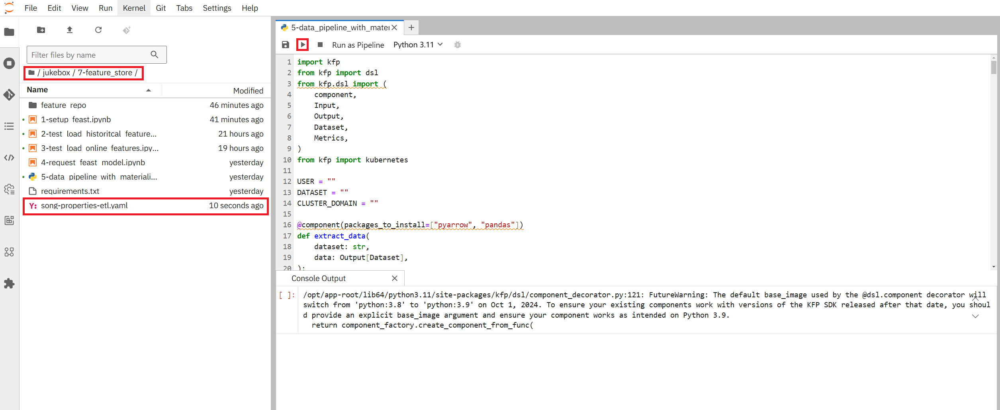
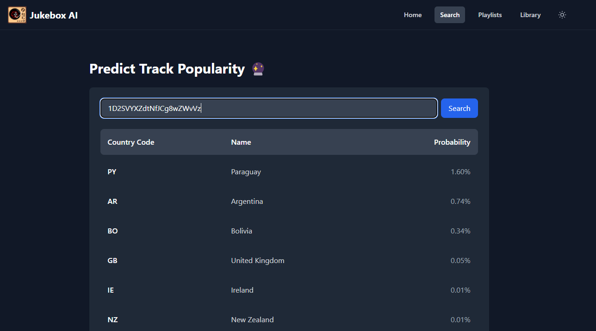

# Apply and Materialize in Our Pipelines

To ensure our features are always up-to-date and ready for use, we need to **materialize** them automatically. Materialization refers to the process of making feature data available in the online store for real-time inference or serving.

We don’t want to manually apply feature changes and trigger materialization each time we update the features. Instead, we’ll automate these steps within our pipelines, ensuring that feature changes are automatically applied, materialized, and ready for consumption without any manual intervention.

Yes, you guessed it right, It means _yet another pipeline._ 😅

## Automatically Materialize New Data  

When new data points arrive in our system, we need to ensure that our **online feature store** is updated with the latest feature values. To achieve this, we will **materialize** incoming data incrementally—only materializing new data based on a timestamp, rather than reprocessing everything.  

To implement this, we will update our **ETL pipeline** to include a materialization step after the data has been uploaded to **S3**. 

With only the most recent data is materialized, we'll reduce unnecessary data load on the system, keep our feature store continuously up-to-date and ready for real-time inference with minimal processing overhead.


1. Go to the UI and search for [Some Song]. Nothing should show up as we haven't yet added that song to our online feature store.
   
    

2. Go to your `Jupyter Notebook` workbench, open up `jukebox/7-feature_store/5-data_pipeline_with_materialize.py` and press the Run button.
    

3. Download the new file it produced.
   
4. In `OpenShift AI` dashboard, go to `Data Science Pipelines` and navigate to your <USER_NAME>-mlops project. In here we will import the downloaded pipeline file by creating a new version for our current ETL pipeline.
   
    

5. Since we don't want to wait for the scheduled run, let's kick off a pipeline run immediately.
   
6. Go back to the UI and search for `` (the ID for [Some Song]) and press Search. You won't get a dropdown since our frontend isn't synched with our online feature store, but we will now get a prediction on the song!
   
    

## Automatically Apply New Changes

To apply new changes to our feature store, we can add a step to our Continous Training pipeline to see if there has been any change to our features before we start training.  

1. Go to `mlops-gitops/toolings/ct-pipeline/config.yaml` and update it:

    ```yaml
    chart_path: charts/pipelines
    USER_NAME: <USER_NAME>
    cluster_domain: <CLUSTER_DOMAIN>
    git_server: <GIT_SERVER>
    alert_trigger: true
    apply_feature_changes: true # 👈 add this
    ```

2. Commit the changes to the repo:

    ```bash
    cd /opt/app-root/src/mlops-gitops
    git add .
    git commit -m "✅ Features automatically applied ✅"
    git push
    ```

3. To try it out, we can remove one feature and make sure that everything from training to inference with the UI still works.
     
    Go to your `Jupyter Notebook` and navigate to `jukebox/7-feature_store/feature_repo/feature_service.py`. Here we can remove line 14 (the feature `loudness`) as we saw in the data exploration how it was highly correlated with another feature (`energy`) so we don't need both:

    ```python
    from feast import FeatureService

    from features import song_properties

    song_properties_fs = FeatureService(
        name="serving_fs",
        features=[
            song_properties[[
                "is_explicit",
                "duration_ms",
                "danceability",
                "energy",
                "key",
                # "loudness", # 👈 change this to a comment
                "mode",
                "speechiness",
                "acousticness",
                "instrumentalness",
                "liveness",
                "valence",
                "tempo"
                ]]
        ]
    ) 
    
    ```
    > Note: you could also create a new version, but this is easier in this case, git will version it anyhow.

4. Save the file and commit your change to git by running this in your terminal:
   
    ```bash
    cd /opt/app-root/src/jukebox/
    git add 7-feature_store/feature_repo/feature_service.py
    git commit -m "🎺 Remove feature loudness 🎺"
    git push
    ```

5. Now we just need to wait for the Continous Training pipeline to finish.  
   

    To keep track of the Kubeflow training pipeline in OpenShift AI, you can go to `Experiments` -> `Experiment and Runs` -> `training`.  

    💥SCREENSHOT

    You can also keep track of the OpenShift pipeline in the `OpenShift Console` by going to `Pipelines` -> `Pipeline Runs`.  

    When the OpenShift pipeline has finished, we have a new model deployed ready to be tested.

    💥SCREENSHOT  

6. Go to the Jukebox UI (https://jukebox-ui-<USER_NAME>-test.<CLUSTER_DOMAIN>) and search for a song, it should still work (and give a different result than before) even though we haven't changed the UI at all, Feast takes care of the feature change 👏👏
