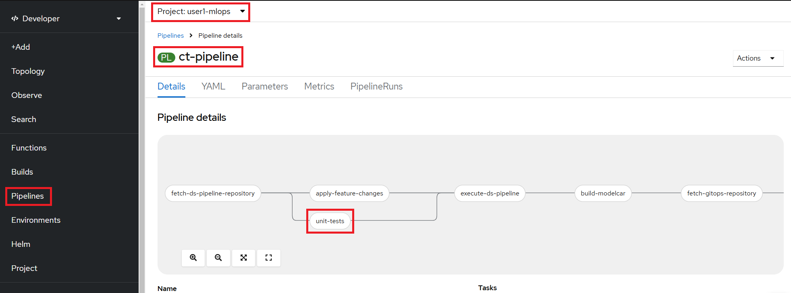

# Unit Testing 

Unit testing is a common practice in standard software development as it allows you to test components of your code individually to make sure each of them work as expected.  
Maybe unsurprisingly, this is something we want to do in AI development as well, to make sure that all components that go into creating and evaluating our models function properly.  

We have already set up a unit test for one of the pipeline components, let's try it out!

1. Go to your code server workbench and on the terminal run the below code:

    ```bash
    cd /opt/app-root/src/
    git clone https://<USER_NAME>:<PASSWORD>@gitea-gitea.<CLUSTER_DOMAIN>/<USER_NAME>/jukebox.git
    cd /opt/app-root/src/jukebox/3-prod_datascience
    pip install -r tests/requirements.txt
    PYTHONPATH=$(pwd) PYTHONDONTWRITEBYTECODE=1 pytest tests/test_fetch_data.py -p no:cacheprovider
    ```
    If you want to take a look at the code, you can find it in `jukebox/3-prod_datascience/tests/test_fetch_data.py`.  
    Here we are testing if the data we load have the expected number and order of columns.  
2. After a while (a couple of minutes), you should get an output similar to this:
      
    Looks like we passed the check!


## Automatic unit testing

Now that we are able to test our pipeline, let's make sure it gets tested each time we change our code (like good software developers 🧑‍💻).  
To do that, we can simply add it to our training pipeline, which will be ran at any code change.  

1. Go to `mlops-gitops/toolings/ct-pipeline/config.yaml` and add `unit_tests: true` to enable automatic testing:

    ```yaml
    chart_path: charts/pipelines
    USER_NAME: <USER_NAME>
    cluster_domain: <CLUSTER_DOMAIN>
    git_server: <GIT_SERVER> 
    alert_trigger: true 
    unit_tests: true # 👈 add this
    ```

2. Now we can push the change to git:

    ```bash
    cd /opt/app-root/src/mlops-gitops
    git pull
    git add .
    git commit -m "🧪 unit tests added 🧪"
    git push
    ```

    If you go to the OpenShift Console > Pipelines in `<USER_NAME>-mlops` namespace, you should now see a task called `unit-tests` in your pipeline:

    

3. Finally, we can start a pipeline run through an empty commit to our jukebox repo to see how it runs:

    ```bash
    cd /opt/app-root/src/jukebox
    git commit --allow-empty -m "🤞 trigger pipeline for unit-testing 🤞"
    git push
    ```