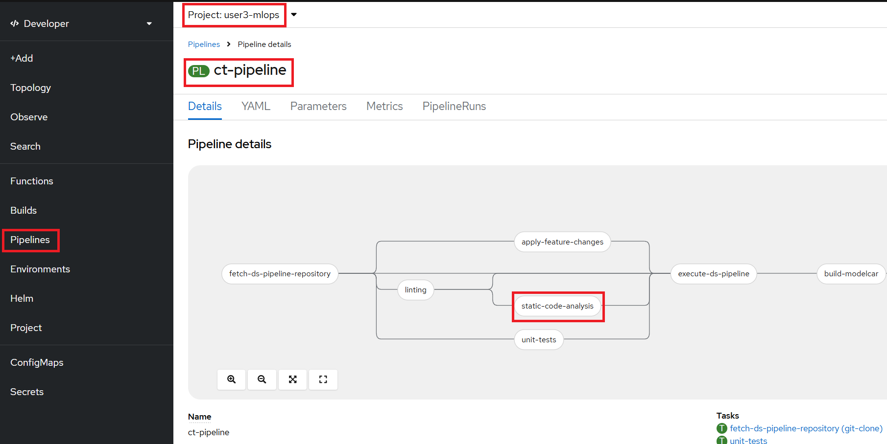
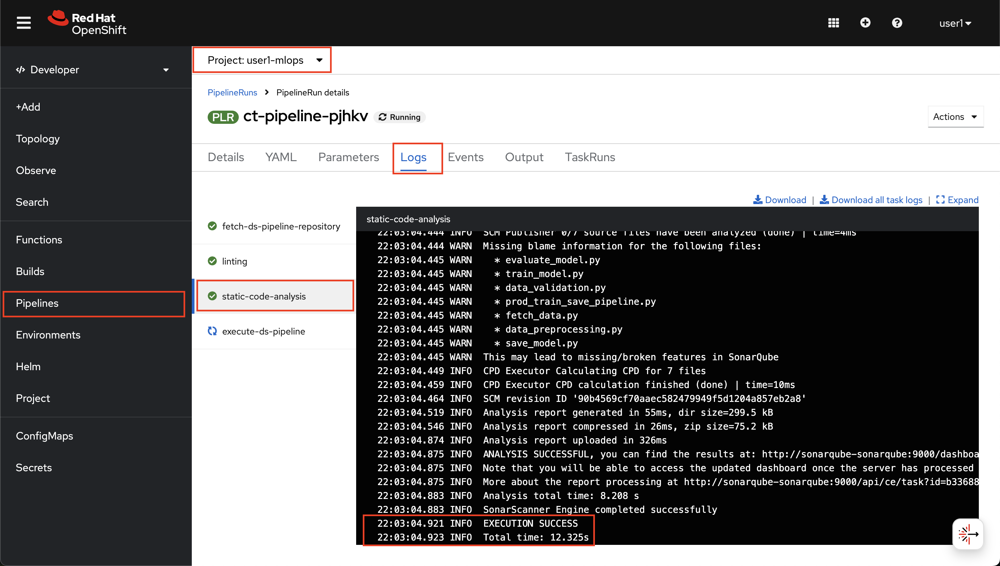
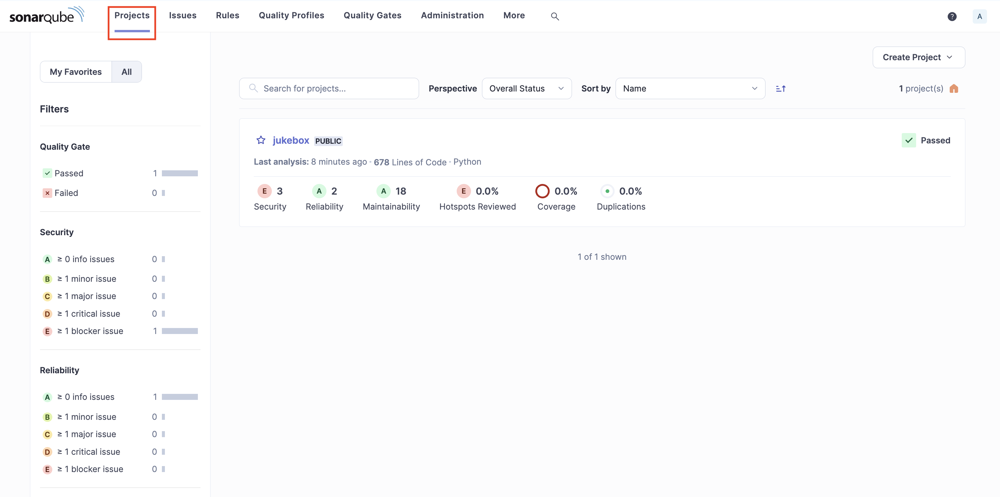
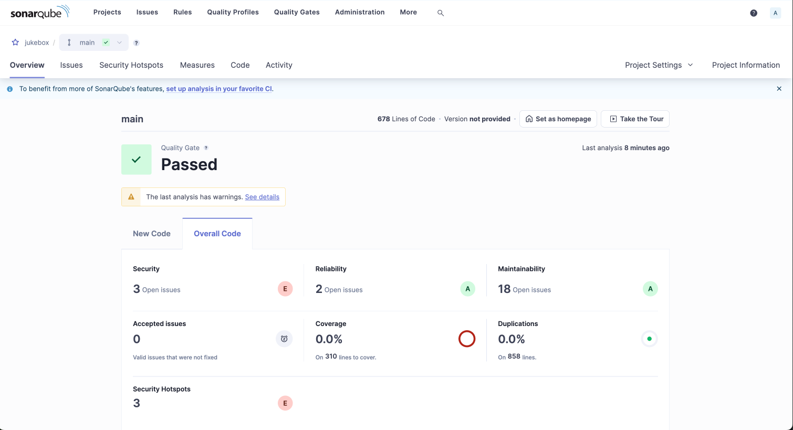
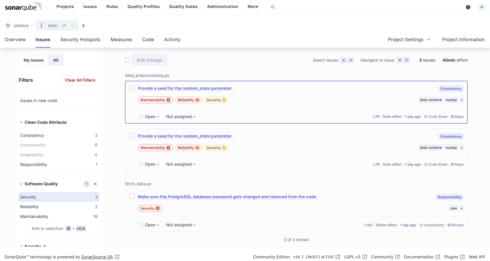

# Sonarqube

> Sonarqube is a tool that performs static code analysis. It looks for pitfalls in coding and reports them. It’s great tool for catching vulnerabilities!

## Deploy Sonarqube using GitOps

1. Create a `sonarqube` folder under `mlops-gitops/toolings` folder

    ```bash
    mkdir /opt/app-root/src/mlops-gitops/toolings/sonarqube
    touch /opt/app-root/src/mlops-gitops/toolings/sonarqube/config.yaml
    ```

2. Open up the `sonarqube/config.yaml` file and paste the below yaml to `config.yaml`. It contains the information about where Argo CD can find the helm chart of SonarQube, and the values we'd like to provide to this helm chart.

    ```yaml
    repo_url: https://github.com/redhat-cop/helm-charts.git
    chart_path: charts/sonarqube
    account:
      username: admin
      password: admin123
      currentAdminPassword: admin
    plugins:
      install:
        - https://github.com/checkstyle/sonar-checkstyle/releases/download/10.9.3/checkstyle-sonar-plugin-10.9.3.jar
        - https://github.com/dependency-check/dependency-check-sonar-plugin/releases/download/3.1.0/sonar-dependency-check-plugin-3.1.0.jar
    ```

    _Yup, we are aware that it is not sensible to store credentials as plaintext here but we haven't discussed Secret Management with GitOps, so hang in there!🫣_

3. Push the changes and let Argo CD to deploy SonarQube:

    ```bash
    cd /opt/app-root/src/mlops-gitops
    git pull
    git add .
    git commit -m  "🦇 ADD - sonarqube 🦇"
    git push 
    ```

4. Connect to [SonarQube UI](https://sonarqube-<USER_NAME>-mlops.<CLUSTER_DOMAIN>/) to verify if the installation is successful (username `admin` & password `admin123`).

    _It may take a few minutes to configure SonarQube._

    ```bash
    echo https://$(oc get route sonarqube --template='{{ .spec.host }}' -n <USER_NAME>-mlops)
    ```

    _And in case you logged out from the cluster, use below commands to login again._

    ```bash
    export CLUSTER_DOMAIN=<CLUSTER_DOMAIN>
    oc login --server=https://api.${CLUSTER_DOMAIN##apps.}:6443 -u <USER_NAME> -p <PASSWORD>
    ```

5. Now that we have SonarQube, let's extend our pipeline to perform static code analysis chech. Again, let's open up `mlops-gitops/toolings/ct-pipeline/config.yaml` and add `static_code_analysis: true` flag to introduce [the task](https://<GIT_SERVER>/<USER_NAME>/mlops-helmcharts/src/branch/main/charts/pipelines/templates/tasks/static-code-analysis.yaml).

    ```yaml
    chart_path: charts/pipelines
    USER_NAME: <USER_NAME>
    cluster_domain: <CLUSTER_DOMAIN>
    git_server: <GIT_SERVER> 
    alert_trigger: true 
    unit_tests: true
    linting: true 
    static_code_analysis: true # 👈 add this
    ```

6. Commit the changes to the repo:

    ```bash
    git pull
    cd /opt/app-root/src/mlops-gitops
    git add .
    git commit -m "🧦 ADD - static code analysis step 🧦"
    git push
    ```

7. Kick off a pipeline with an empty commit to see the changes on the pipeline:

    ```bash
    cd /opt/app-root/src/jukebox
    git commit --allow-empty -m "🐹 trigger pipeline for SonarQube scan 🐹"
    git push
    ```

8. Go to OpenShift Console > Pipelines in `<USER_NAME>-mlops` namespace > verify that the task is included in the new Pipeline run.

    

    

9. When static ode analysis step completed, go back to [SonarQube UI](https://sonarqube-<USER_NAME>-mlops.<CLUSTER_DOMAIN>/), refresh the page and see that `jukebox` is under  `Projects`

    

    Click on `jukebox` project and see the results of the analysis.

    

    You can drill down on the issues that SonarQube identified.

    